name: title
class: inverse, center, middle

```{r setup, include=FALSE}
options(htmltools.dir.version = FALSE)
knitr::opts_chunk$set(
  warning = FALSE, message = FALSE, fig.retina = 3, fig.width = 15
)
library(dplyr)
library(RBERT)
library(RBERTviz)
```

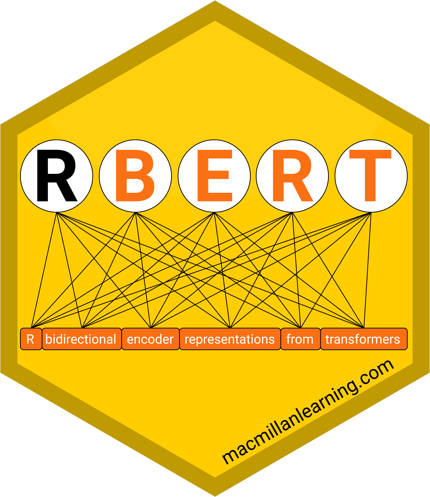

## Cutting-Edge NLP in R

.Large[Jon Harmon | DCR | 9 November 2019]

---

name: acknowledgement

# RBERT Lead Author

.pull-left[

]

.pull-right[
## Jonathan Bratt
###Macmillan Learning
###github.com/jonathanbratt
]

---

name: outline

# Outline

.Large[
**Follow along/like/reply/retweet at [bit.ly/jonvsemily](http://bit.ly/jonvsemily) and help me win headphones!**

* Transfer Learning
* BERT
* RBERT & RBERTviz
* Attention
* Layer Outputs
]

---

# Transfer Learning

.pull-left[
.Large[
* Task: Classify images (ImageNet)
]
]

---

count: false

# Transfer Learning

.pull-left[
.Large[
* Task: Classify images (ImageNet)
* Early layers: simple features.
]]

<div width="50%">
<p  style="padding-left:10">Credit: <a href="http://yosinski.com/deepvis">deepvis</a> by Jason Yosinski, Jeff Clune, Anh Nguyen, Thomas Fuchs, and Hod Lipson</p>
<div width="50%" style="float:left">
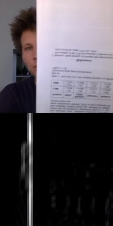

</div>
<div width="50%" style="float:right">
</div>
</div>

---

count: false

# Transfer Learning

.pull-left[
.Large[
* Task: Classify images (ImageNet)
* Early layers: simple features.
* Later layers: complex features.
* Features can transfer to many tasks.
]
]

<div width="50%">
<p  style="padding-left:10">Credit: <a href="http://yosinski.com/deepvis">deepvis</a> by Jason Yosinski, Jeff Clune, Anh Nguyen, Thomas Fuchs, and Hod Lipson</p>
<div width="50%" style="float:left">


</div>
<div width="50%" style="float:right">

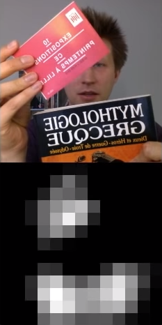
</div>
</div>

---

# Transfer Learning: NLP

.Large[
* Word embeddings
  * word2vec
  * GloVe
* king − man + woman ≅ queen
]

---

count: false

# Transfer Learning: NLP

.Large[
* Word embeddings
  * word2vec
  * GloVe
* king − man + woman ≅ queen
* Problem: Each word has *one* embedding vector.
  * "I saw the *branch* on the *bank*" vs 
  * "I saw the *branch* of the *bank*"
]

---

# BERT

.Large[
* **B**idirectional **E**ncoder **R**epresentations from **T**ransformers
* Initially released October 11, 2018
  * Jacob Devlin, Ming-Wei Chang, Kenton Lee, and Kristina Toutanova from Google AI Language
* Trained with a very large corpus
* Transferable!
]

---

# RBERT

.pull-left[
.Large[
* `install_github("jonathanbratt/RBERT")`
* Implementation of BERT in R
* Use for:
  * Feature extraction (text to high-dimensional vectors)
  * Soon: Fine-tuning
]
]

.pull-right[

]

---

# RBERTviz

.pull-left[
.Large[
* `install_github("jonathanbratt/RBERTviz")`
* Helper package
* Visualize how BERT "thinks"
  * `visualize_attention`
  * `display_pca`
]
]

.pull-right[

]

---

# Attention

.pull-left[
```{r attention, eval=FALSE}
RBERT::download_BERT_checkpoint(
  "bert_base_uncased"
)
RBERT::extract_features(
  "I love tacos.",
  model = "bert_base_uncased",
  layer_indexes = 1:12,
  features = "attention"
)$attention %>%
  RBERTviz::visualize_attention()
```

Based on Jesse Vig's [bertviz](https://github.com/jessevig/bertviz) tool.
]
.pull-right[
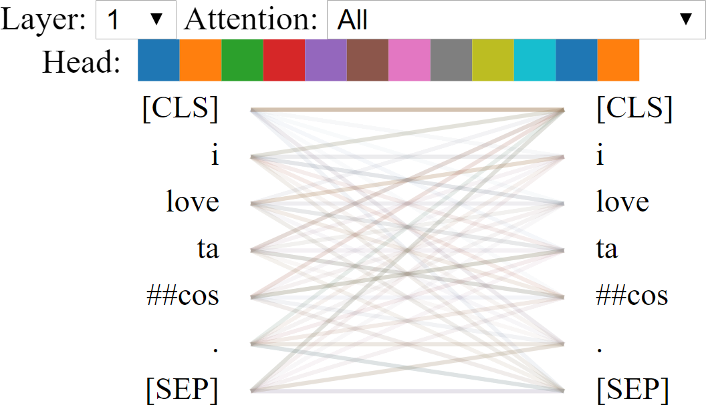
]

[Live demo](tacos_viz.html)

---

# Attention

.Large[
Sentences:

* The chicken didn't cross the road because it was too tired.
* The chicken didn't cross the road because it was too wide.
* The dog fetched the ball. It was excited.
* The dog fetched the ball. It was blue.
]

---

count: false

# Attention

.Large[
Sentences:

* The **chicken** didn't cross the road because **it** was too **tired.**
* The chicken didn't cross the **road** because **it** was too **wide.**
* The **dog** fetched the ball. **It** was **excited.**
* The dog fetched the **ball.** **It** was **blue.**
]

---

# Attention


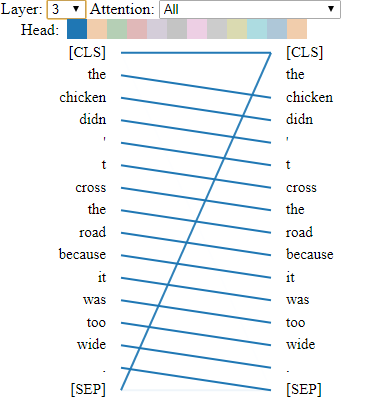
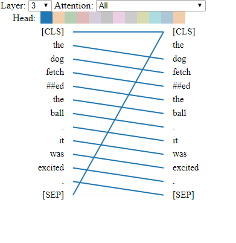
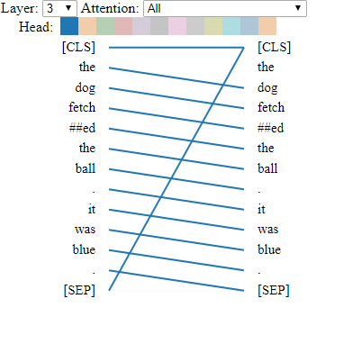

.Large[Early: Position (≈ edge detector)]

---

# Attention

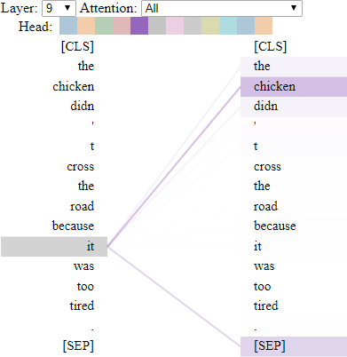

.Large[Later: Pronoun Resolution (≈ face detector)]

---

count: false

# Attention


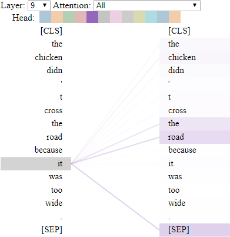
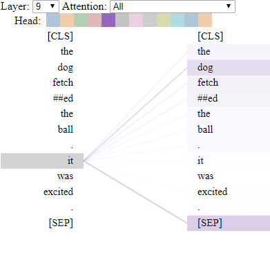
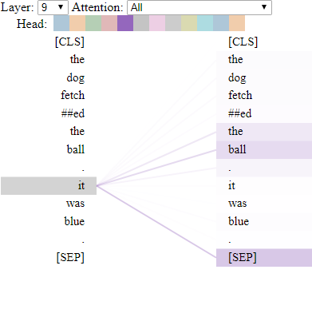

.Large[Later: Pronoun Resolution (≈ face detector)]

---

# Layer Outputs

.pull-left[
.Large[
Online survey:

* "A single sentence about learning, WITH the word 'train' (or 'trained', 'training', etc, meaning 'teach')."
* "A single sentence about travel, WITH the word 'train' (as in the vehicle)."
]]

.pull-right[
```{r layer-outputs, eval=FALSE}
trains_data <- readRDS("trains_data.rds") %>%
  dplyr::mutate(
    sequence_index = dplyr::row_number()
  )

trains_output <- RBERT::extract_features(
  trains_data$sentence,
  model = "bert_base_uncased",
  layer_indexes = 0:12,
  features = "output"
)$output

trains_output_labeled <- trains_output %>%
  dplyr::left_join(
    dplyr::select(
      trains_data, 
      sequence_index, label
    ),
    by = "sequence_index"
  )
```
]

```{r load-trains, include=FALSE}
trains_output_labeled <- readRDS(here::here("data", "trains_output_labeled.rds"))
projection_df <- trains_output_labeled %>% 
  dplyr::filter(layer_index %in% c(0, 12))
source(here::here("R", "display_pca_dev.R"), local = TRUE)
```

---

# Layer Outputs

.pull-left[
```{r layer-0, fig.show="hide", include=FALSE}
trains_output_labeled %>% 
  dplyr::filter(
    stringr::str_detect(token, "^train"),
    layer_index == 0,
    sequence_index %in% c(2, 16, 1, 3)
  ) %>% 
  display_pca_dev(
    project_vectors = projection_df,
    # color_field = "label",
    disambiguate_tokens = FALSE
  ) +
  ggplot2::scale_y_continuous(limits = c(-20, 25), labels = NULL) +
  ggplot2::scale_x_continuous(limits = c(-25, 20), labels = NULL)
```
```{r layer-0-ideal, eval=FALSE}
trains_output_labeled %>% 
  RBERTviz::display_pca(
    token_filter = "^train",
    layer_index = 0,
    # Just show one example of each unique word
    distinct_tokens = TRUE
  )
```
]

.pull-right[
```{r layer-0-plot, ref.label="layer-0", echo=FALSE, fig.width=7}

```
]

---

# Layer Outputs

Layer 0 (initial vectors)

```{r layer-0-labeled, echo=FALSE}
trains_output_labeled %>% 
  dplyr::filter(
    stringr::str_detect(token, "^train"),
    layer_index == 0
  ) %>% 
  display_pca_dev(
    project_vectors = projection_df,
    color_field = "label",
    disambiguate_tokens = FALSE
  ) +
  ggplot2::scale_y_continuous(limits = c(-20, 25), labels = NULL) +
  ggplot2::scale_x_continuous(limits = c(-25, 20), labels = NULL) +
  ggplot2::theme(legend.position = "none")
```
---
count: false

# Layer Outputs

Layer 1

```{r layer-1, echo=FALSE}
trains_output_labeled %>% 
  dplyr::filter(
    stringr::str_detect(token, "^train"),
    layer_index == 1
  ) %>% 
  display_pca_dev(
    project_vectors = projection_df,
    color_field = "label",
    disambiguate_tokens = FALSE
  ) +
  ggplot2::scale_y_continuous(limits = c(-20, 25), labels = NULL) +
  ggplot2::scale_x_continuous(limits = c(-25, 20), labels = NULL) +
  ggplot2::theme(legend.position = "none")
```
---
count: false

# Layer Outputs

Layer 2

```{r layer-2, echo=FALSE}
trains_output_labeled %>% 
  dplyr::filter(
    stringr::str_detect(token, "^train"),
    layer_index == 2
  ) %>% 
  display_pca_dev(
    project_vectors = projection_df,
    color_field = "label",
    disambiguate_tokens = FALSE
  ) +
  ggplot2::scale_y_continuous(limits = c(-20, 25), labels = NULL) +
  ggplot2::scale_x_continuous(limits = c(-25, 20), labels = NULL) +
  ggplot2::theme(legend.position = "none")
```
---
count: false

# Layer Outputs

Layer 3

```{r layer-3, echo=FALSE}
trains_output_labeled %>% 
  dplyr::filter(
    stringr::str_detect(token, "^train"),
    layer_index == 3
  ) %>% 
  display_pca_dev(
    project_vectors = projection_df,
    color_field = "label",
    disambiguate_tokens = FALSE
  ) +
  ggplot2::scale_y_continuous(limits = c(-20, 25), labels = NULL) +
  ggplot2::scale_x_continuous(limits = c(-25, 20), labels = NULL) +
  ggplot2::theme(legend.position = "none")
```
---
count: false

# Layer Outputs

Layer 4

```{r layer-4, echo=FALSE}
trains_output_labeled %>% 
  dplyr::filter(
    stringr::str_detect(token, "^train"),
    layer_index == 4
  ) %>% 
  display_pca_dev(
    project_vectors = projection_df,
    color_field = "label",
    disambiguate_tokens = FALSE
  ) +
  ggplot2::scale_y_continuous(limits = c(-20, 25), labels = NULL) +
  ggplot2::scale_x_continuous(limits = c(-25, 20), labels = NULL) +
  ggplot2::theme(legend.position = "none")
```
---
count: false

# Layer Outputs

Layer 5

```{r layer-5, echo=FALSE}
trains_output_labeled %>% 
  dplyr::filter(
    stringr::str_detect(token, "^train"),
    layer_index == 5
  ) %>% 
  display_pca_dev(
    project_vectors = projection_df,
    color_field = "label",
    disambiguate_tokens = FALSE
  ) +
  ggplot2::scale_y_continuous(limits = c(-20, 25), labels = NULL) +
  ggplot2::scale_x_continuous(limits = c(-25, 20), labels = NULL) +
  ggplot2::theme(legend.position = "none")
```
---
count: false

# Layer Outputs

Layer 6

```{r layer-6, echo=FALSE}
trains_output_labeled %>% 
  dplyr::filter(
    stringr::str_detect(token, "^train"),
    layer_index == 6
  ) %>% 
  display_pca_dev(
    project_vectors = projection_df,
    color_field = "label",
    disambiguate_tokens = FALSE
  ) +
  ggplot2::scale_y_continuous(limits = c(-20, 25), labels = NULL) +
  ggplot2::scale_x_continuous(limits = c(-25, 20), labels = NULL) +
  ggplot2::theme(legend.position = "none")
```
---
count: false

# Layer Outputs

Layer 7

```{r layer-7, echo=FALSE}
trains_output_labeled %>% 
  dplyr::filter(
    stringr::str_detect(token, "^train"),
    layer_index == 7
  ) %>% 
  display_pca_dev(
    project_vectors = projection_df,
    color_field = "label",
    disambiguate_tokens = FALSE
  ) +
  ggplot2::scale_y_continuous(limits = c(-20, 25), labels = NULL) +
  ggplot2::scale_x_continuous(limits = c(-25, 20), labels = NULL) +
  ggplot2::theme(legend.position = "none")
```
---
count: false

# Layer Outputs

Layer 8

```{r layer-8, echo=FALSE}
trains_output_labeled %>% 
  dplyr::filter(
    stringr::str_detect(token, "^train"),
    layer_index == 8
  ) %>% 
  display_pca_dev(
    project_vectors = projection_df,
    color_field = "label",
    disambiguate_tokens = FALSE
  ) +
  ggplot2::scale_y_continuous(limits = c(-20, 25), labels = NULL) +
  ggplot2::scale_x_continuous(limits = c(-25, 20), labels = NULL) +
  ggplot2::theme(legend.position = "none")
```
---
count: false

# Layer Outputs

Layer 9

```{r layer-9, echo=FALSE}
trains_output_labeled %>% 
  dplyr::filter(
    stringr::str_detect(token, "^train"),
    layer_index == 9
  ) %>% 
  display_pca_dev(
    project_vectors = projection_df,
    color_field = "label",
    disambiguate_tokens = FALSE
  ) +
  ggplot2::scale_y_continuous(limits = c(-20, 25), labels = NULL) +
  ggplot2::scale_x_continuous(limits = c(-25, 20), labels = NULL) +
  ggplot2::theme(legend.position = "none")
```
---
count: false

# Layer Outputs

Layer 10

```{r layer-10, echo=FALSE}
trains_output_labeled %>% 
  dplyr::filter(
    stringr::str_detect(token, "^train"),
    layer_index == 10
  ) %>% 
  display_pca_dev(
    project_vectors = projection_df,
    color_field = "label",
    disambiguate_tokens = FALSE
  ) +
  ggplot2::scale_y_continuous(limits = c(-20, 25), labels = NULL) +
  ggplot2::scale_x_continuous(limits = c(-25, 20), labels = NULL) +
  ggplot2::theme(legend.position = "none")
```
---
count: false

# Layer Outputs

Layer 11

```{r layer-11, echo=FALSE}
trains_output_labeled %>% 
  dplyr::filter(
    stringr::str_detect(token, "^train"),
    layer_index == 11
  ) %>% 
  display_pca_dev(
    project_vectors = projection_df,
    color_field = "label",
    disambiguate_tokens = FALSE
  ) +
  ggplot2::scale_y_continuous(limits = c(-20, 25), labels = NULL) +
  ggplot2::scale_x_continuous(limits = c(-25, 20), labels = NULL) +
  ggplot2::theme(legend.position = "none")
```
---
count: false

# Layer Outputs

wait a minute...

```{r highlight-bad, echo=FALSE}
trains_output_labeled %>% 
  dplyr::filter(
    stringr::str_detect(token, "^train"),
    layer_index == 11
  ) %>% 
  display_pca_dev(
    project_vectors = projection_df,
    color_field = "label",
    disambiguate_tokens = FALSE
  ) +
  ggplot2::scale_y_continuous(limits = c(-20, 25), labels = NULL) +
  ggplot2::scale_x_continuous(limits = c(-25, 20), labels = NULL) +
  ggplot2::theme(legend.position = "none") + 
  ggplot2::geom_point(
    data = data.frame(x = 8.2, y = -1.2),
    mapping = ggplot2::aes(x = x, y = y),
    color = "red",
    size = 14,
    shape = 1,
    inherit.aes = FALSE
  )
```
---
count: false

# Layer Outputs

wait a minute...

```{r highlight-bad2, echo=FALSE}
trains_output_labeled %>% 
  dplyr::filter(
    stringr::str_detect(token, "^train"),
    layer_index == 11
  ) %>% 
  display_pca_dev(
    project_vectors = projection_df,
    color_field = "label",
    disambiguate_tokens = FALSE
  ) +
  ggplot2::scale_y_continuous(limits = c(-20, 25), labels = NULL) +
  ggplot2::scale_x_continuous(limits = c(-25, 20), labels = NULL) +
  ggplot2::theme(legend.position = "none") + 
  ggplot2::geom_point(
    data = data.frame(x = 8.2, y = -1.2),
    mapping = ggplot2::aes(x = x, y = y),
    color = "red",
    size = 14,
    shape = 1,
    inherit.aes = FALSE
  ) + 
  ggplot2::annotate(
    "text",
    x = -3, y = -1.75,
    label = '"train your vehicle with travelling"',
    size = 10
  )
```
---

# To Do

.Large[
* RBERT is usable *now*...
]

---
count: false

# To Do

.Large[
* RBERT is usable *now*...
* ...but it can be *better!*
]

---
count: false

# To Do

.Large[
* RBERT is usable *now*...
* ...but it can be *better!*
* Goal: CRAN by end of 2019
]

---
count: false

# To Do

.Large[
* RBERT is usable *now*...
* ...but it can be *better!*
* Goal: CRAN by end of 2019
  * tensorflow 2.0 (in testing)
  * More Rtful, less pythonic
  * Recipe: `step_bert_features()`
]

---
count: false

# To Do

.Large[
* RBERT is usable *now*...
* ...but it can be *better!*
* Goal: CRAN by end of 2019
  * tensorflow 2.0 (in testing)
  * More Rtful, less pythonic
  * Recipe: `step_bert_features()`
* `rstudio::conf(2020L)` e-poster
* Poster ideas? [bit.ly/rbertposter](http://bit.ly/rbertposter)
]

---

# Contact

.Large[
* Twitter: [@jonthegeek](https://twitter.com/JonTheGeek) (like/retweet/reply to #rstatsDC tweets!)
* [github.com/jonathanbratt/RBERT](github.com/jonathanbratt/RBERT)
* [github.com/jonathanbratt/RBERTviz](github.com/jonathanbratt/RBERTviz)
* [github.com/jonthegeek](github.com/jonthegeek)
* R4DS Online Learning Community: [r4ds.online](r4ds.online)
* TidyTuesday Podcast: [tidytuesday.com](tidytuesday.com)

]
